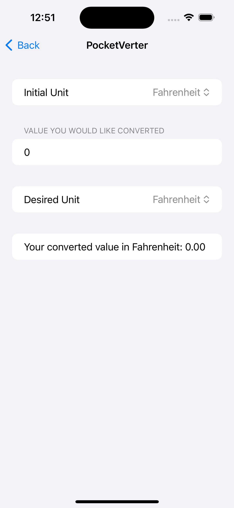

#PocketVerter

A simple app that initially only had the objective of allowing the user to convert temperatures between Fahrenheit, Celcius, and Kelvin.
This was one of the first few projects I worked on when learning Swift while I was upskilling at my appretinceship. It taught me many fundamental ideas however it in itself was a short project which left much to be desired.

Below is an image of a working app that fufilled the critera the project had to meet.

