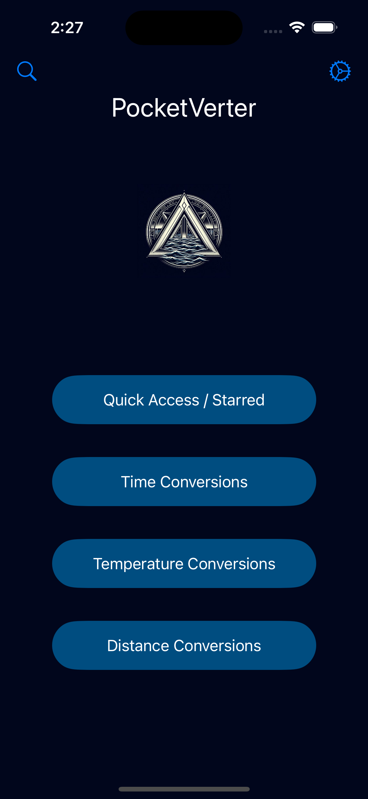
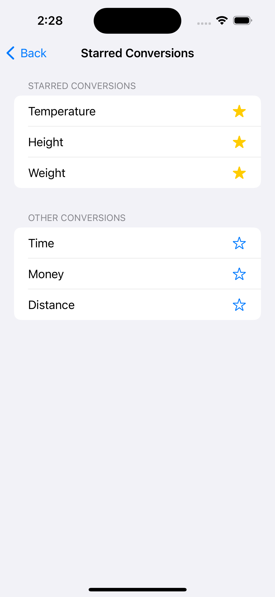
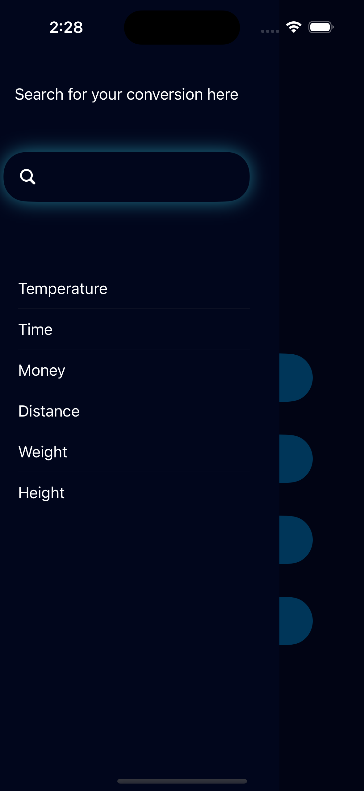

<h1>PocketVerter</h1>

A simple app that initially only had the objective of allowing the user to convert temperatures between Fahrenheit, Celcius, and Kelvin.
This was one of the first few projects I worked on when learning Swift while I was upskilling at my appretinceship. It taught me many fundamental ideas however it in itself was a short project which left much to be desired.

Below is an image of a working app that fufilled the critera the project had to meet.

As displayed, the initial iteration seemingly looked like a settings for an iphone with no real individual look to it. A few fields and a few pickers left much to be achieved so coming back to the project after working on a few others and completing projects in my apprenticeship I decided to add a few features that would be the skeletal structure behind a bigger app idea.

<h2>Feature 1: Landing Page</h2>

To give the project an app appearance I wanted to create a landing page, one which would also leave room for an increase of scope for the project. Since it was about conversion, I thought, "What other conversions do I need in my daily life?" and I realized there were a few that did come up and others that didn't come up that frequently.

Below is the current iteration of the landing page.

Using a wireframing website, I drew up an initial prototype and recreated the layout with an initial impression of using buttons for the design. I quickly learned that using buttons while trying to create an ontap animation and navigation at the same time created many issues. For that reason I decided to create a custom struct that would behave like a button however this also didn't allow for animations the way I intended. I scrapped the idea of animating the button due to the fact that it was a very niche detail without much benefit for the user.

I wanted the app to have a unique logo as most apps do but due to not being much of an artist and argubably a little lazy, I decided to let AI develope the pocketverter logo for me.

<h2>Feature 2: Preferences (Unfinished)</h2>

I wanted to add some sort of customization to this app. While there aren't many things that could be customized in this app besides maybe the app style itself, I thought about the possibility of having this app one day become a much larger project and in that case, some sort of search feature and a way to save often used conversions would be nice. Below is the current iteration of this preferences view.

Not too many changes were made to this view especially the background which could be changed to have a more consistent feel to the app but most importantly, I added a search bar using the .searchable modifier for the first time in any project. An issue that could be addressed would be having the search bar appear without having to scroll up. Without the faults, the idea of this view is simple and would simply pass the saved items into an array that would then be used in the landing page in order to quickly access these conversions. In all honestly the more I worked on this project the less and less I saw a reason to have this feature but it was more about creating the option and maybe working with appState early on in personal projects but that will be saved for later. 

<h3>Feature 3: SideMenu Search Bar </h3>

Last but not least I wanted to have somewhat of a sheet slideover in order to showcase a search bar the user could use to quickly look through the possible list of conversion and quickly navigate over. While my initial impressions were working with actual sheets, modals, or even a navigationsplitview, I decided to take the route of creating a custom view and adding an animation to it. Below is an image showcasing the feature.

This was one of my favorite additions due to the frustrations I had working with .searchable and it not working the way I was hoping it would. It was also a first dive into real customization of items in a way that made the app feel unique to me. It helped refresh usages of animations while learning ways to customize lists. 

All in all this was a good first project to go back to in order to showcase some techinal skills I used frequently in my apprenticeship. I can see a potential of creating methods that would allow many different types of conversions to occur without using the logic I used for temperature conversions and allowing the internet to do that for me. Specifically just sending the unit to a search engine and allowing that to do the work for me instead of hard coding the equations for conversions. 

Thank you for looking at this project!

